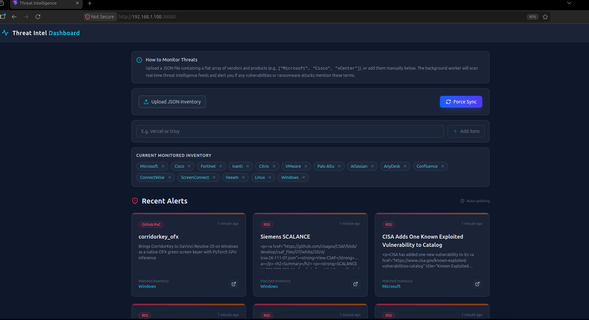

# 🛡️ Threat Intelligence Dashboard

A personal, self-hosted threat intelligence dashboard that monitors real-time vulnerability feeds and alerts you when vendors/products in your inventory are mentioned in CVEs, ransomware reports, or security advisories.



## Features
- 📡 Real-time threat feed monitoring (CISA, BleepingComputer, GitHub PoCs)
- 📦 Upload a JSON inventory of vendors/products to track
- ➕ Manually add or remove inventory items from the UI
- 🔔 Automatically matched alerts displayed on the dashboard
- 🔄 Background sync worker with force-sync option
- 🐳 Docker Compose for local development
- ☸️ Helm chart for Kubernetes / k3s deployment

---

## ⚡ Quickest Way (No Clone Required)

Just create a `docker-compose.yml` anywhere on your machine with this content:

```yaml
services:
  app:
    image: ghcr.io/sreekumar6699/threat-dashboard:latest
    ports:
      - "8000:8000"
    environment:
      - DATABASE_URL=postgresql+asyncpg://postgres:postgres@db:5432/threatdb
    depends_on:
      - db

  db:
    image: postgres:15-alpine
    environment:
      - POSTGRES_USER=postgres
      - POSTGRES_PASSWORD=postgres
      - POSTGRES_DB=threatdb
    volumes:
      - postgres_data:/var/lib/postgresql/data

volumes:
  postgres_data:
```

Then run:
```bash
docker compose up -d
```

Open **http://localhost:8000** — done! 🎉

---

## 🚀 Full Setup (Clone & Build Yourself)


### Prerequisites
- [Docker](https://docs.docker.com/get-docker/) and Docker Compose

### Steps

**1. Clone the repository**
```bash
git clone https://github.com/sreekumar6699/threat-dashboard.git
cd threat-dashboard
```

**2. Create your environment file**
```bash
cp .env.example .env
```

Edit `.env` and set your own values:
```env
POSTGRES_USER=postgres
POSTGRES_PASSWORD=your_secure_password
POSTGRES_DB=threatdb
DATABASE_URL=postgresql+asyncpg://postgres:your_secure_password@db:5432/threatdb
```

**3. Start the application**
```bash
docker compose -f docker/docker-compose.yml up -d
```

**4. Open the dashboard**

Visit **http://localhost:8000** in your browser.

---

## ☸️ Kubernetes / k3s Deployment

### Prerequisites
- A running Kubernetes cluster (k3s, minikube, etc.)
- [Helm](https://helm.sh/docs/intro/install/) installed
- kubectl configured

### Steps

**1. Create the namespace**
```bash
kubectl create namespace threat-int
```

**2. Install with Helm**
```bash
helm upgrade --install my-threat-dashboard ./kubernetes/helm \
  --namespace threat-int \
  --set app.image.repository=ghcr.io/sreekumar6699/threat-dashboard \
  --set app.image.tag=latest \
  --set postgres.auth.password=your_secure_password
```

**3. Access the dashboard**

The app is exposed on `NodePort 30080`:
```bash
http://<your-node-ip>:30080
```

---

## 📋 Inventory File Format

Upload a `.json` file containing a flat list of vendor or product names you want to monitor:

```json
[
  "Microsoft",
  "Cisco",
  "Fortinet",
  "Ivanti",
  "VMware",
  "Linux"
]
```

A ready-to-use sample file is included: `sample_inventory.json`

---

## 🏗️ Project Structure

```
.
├── backend/                # FastAPI application
│   ├── main.py             # App entrypoint & lifespan
│   ├── models.py           # SQLAlchemy models
│   ├── database.py         # DB engine setup
│   ├── worker.py           # Background threat sync scheduler
│   └── routers/api.py      # All API endpoints
├── frontend/               # React + Vite frontend
│   └── src/
│       ├── App.jsx
│       ├── components/
│       │   ├── Dashboard.jsx
│       │   └── InventoryUpload.jsx
│       └── services/api.js
├── docker/
│   ├── Dockerfile          # Multi-stage build
│   └── docker-compose.yml  # Local dev stack
├── kubernetes/helm/        # Helm chart for k8s/k3s
├── .env.example            # Environment variable template
└── sample_inventory.json   # Sample vendor list for testing
```

---

## 🖼️ Docker Image

Pre-built image is available on GHCR:

```bash
docker pull ghcr.io/sreekumar6699/threat-dashboard:latest
```
